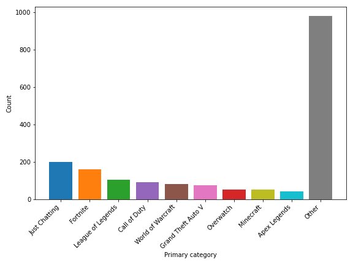
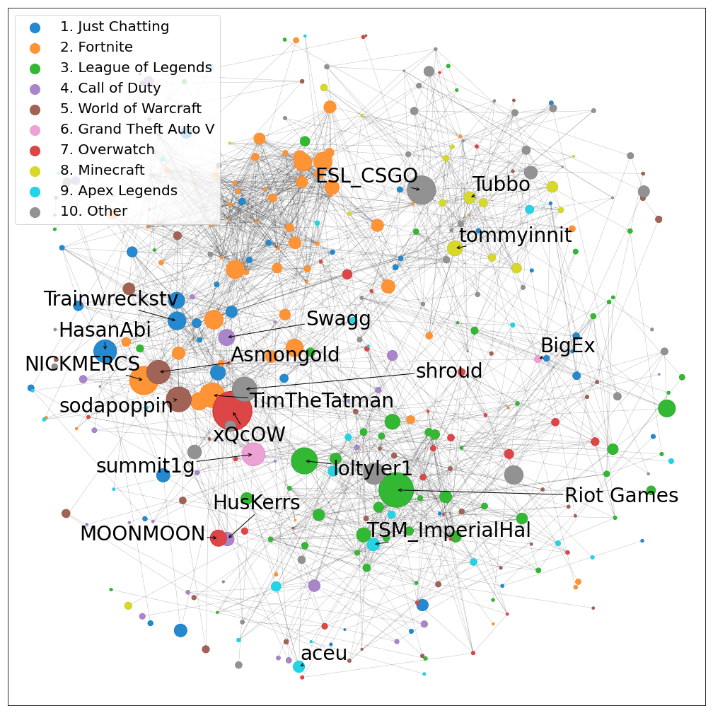

# Twitch recommendations

## Overview

The goal of this project was to develop a recommendation engine for Twitch.tv, a popular live streaming website. Specifically, we wanted to recommend streamers for Twitch users to watch. 

**Check out the demo** 👇

https://www.youtube.com/watch?v=QnJdMOX2L9s

[](https://www.youtube.com/watch?v=QnJdMOX2L9s)

## Setup
### Requirements
Make sure you have Python (==3.7.6 tested), pip, and Git installed. Run `pip install -r requirements.txt` to download dependencies. The versions listed are the ones I used, but you may be able to use earlier/later versions.

There is one issue and it is only a requirement for `Modeling.ipynb` (**you can run the app without it**); [Implicit](https://github.com/benfred/implicit) is not-straightforward to install because (1) [I edited the source code](https://github.com/tysonpond/implicit), (2) it makes use of Cython which requires a C compiler, (3) I don't understand Cython packages at all. All I know is I encountered errors when trying to pip install directly from my repo. My fix is to (1) download a C compiler such as [Microsoft C++ Build Tools](https://visualstudio.microsoft.com/visual-cpp-build-tools/), (2) run `git clone https://github.com/tysonpond/implicit`, (3) `cd` into the cloned directory and run `python setup.py install` to build the package.

### Data collection
To reproduce data collection, you will need to modify `config.py` to reflect your settings (user agent, API key, etc.). 
#### Data collection 1 - Twitch Tracker
For collecting data from Twitch Tracker we use *Selenium*. Selenium requires a driver to interface with the chosen browser. You should download `chromedriver.exe` from https://chromedriver.chromium.org/downloads.

#### Data collection 2 - Twitch API
You can get your API key by registering an application with Twitch. Read how to get started in `Data collection 2 - Twitch API.ipynb` or read the Twitch API [developer docs](https://dev.twitch.tv/docs/api).  

### Flask app
To run the flask app locally, run the command `cd flask_app` and then:

```
$ export FLASK_APP=app.py
$ flask run
* Running on http://127.0.0.1:5000/
```

or for Windows users
```
C:\path\to\app>set FLASK_APP=appy.py
C:\path\to\app>flask run
* Running on http://127.0.0.1:5000/
```

The app will be accessible at http://127.0.0.1:5000/.

## About
### Twitch
Twitch (twitch.tv) is one of the largest live streaming websites. Hosting 3.8M broadcasts and 15M live viewers per day, Twitch competes against the likes of Facebook, Youtube, and Periscope. The platform gained popularity for its gaming live streams and maintains much of this culture today; however, new categories like: "Just Chatting", chess, music, and even programming have since came into the scene.

A critical operation for Twitch is to be able to recommend new channels and categories for users to view. Indeed, after making an account and following a few channels, you will find your homepage populated with recommendations. Providing well-received and diverse recommendations (i.e. not entirely based on popularity) is beneficial to user satisfaction and overall website growth and longevity. In this project, we developed a recommendation system to suggest streamers to users.

### The data
We began by collecting streamer data. We used Twitch Tracker -- a website which stores data from the Twitch API (dating back to 2015) -- to identify the top 2000 English streamers based on most recent 1-month performance. We collected data on each streamer, such as their recent & career metrics, along with what games they play most frequently.

After retrieving the top 2000 English streamers, we set aside only the top 200. We then called the Twitch API and collected their most recent 100 followers (totalling to 20k users). Finally, for each of the 20k users we called the Twitch API to retrieve the list of streamers that they follow. After some additional filtering, our final dataset consisted of 10k unique users, 1.9k unique streamers, and 280k user-streamer follower pairs.

### The model
With our cleaned dataset in hand, we proceeded to model-building. An important characterization of our data is that it is implicit feedback . That is, we can only infer that a user-streamer pair is a positive interaction. An unobserved user-streamer pair could be a positive or negative interaction. With this distinction, we tried several different models for implicit feedback data, including a baseline popularity model, before settling on a hybrid collaborative filtering + content-based model which we implemented in LightFM. We found the best performance by using "percent airtime" for each unique game as an item feature.

The table below shows the best model's performance on the validation and testing sets. We use cutoff-sensitive metrics: precision, recall, and mean average precision (P@K, R@K, and MAP@K respectively) to evaluate performance. 

| Metric | Validation (K=5,10)  | Testing (K=5,10) |
|--------------|-------|-------|
| P@K          | 0.136, 0.103 | 0.136, 0.102 | 
| R@K          | 0.244, 0.353 | 0.253, 0.361 |
| MAP@K        | 0.089, 0.054 | 0.088, 0.053 |

Note: validation and testing sets contained on average only 2-3 relevant items per user. Thus, a typical user can only have a precision score of 20-30% whereas recall can be up to 100%. Our results indicate our model was able to identify 25% of all relevant items within the top 5 recommendations and 36% within the top 10.

### The web app
To serve our model, we used Python's Flask for the backend and HTML, CSS (+Bootstrap), and JavaScript (+jQuery) for the frontend. With the help of jQuery UI autocomplete, the user may input comma separated streamer names. The application will then query our model and return the top 9 recommendations.

If only one streamer is input, an item-based approach is used; the application returns the 9 most similar streamers to the one input. If more than one streamer is input, a user-based approach is used; the application will identify the user in our database with the most similar likes and then return their recommendations. For better user-based results, we would want to retrain the model with the addition of the user input; however, because this takes 1-2 minutes which is unsuitable for a brief demo, we use the simplified approach we've described.

## Insights
See `EDA and Network Analysis.ipynb` for a full analysis. We show two select figures below.

**Top games:** For each of the top 2k streamers we identify their all-time "primary category" (defined as the category/game with the most total airtime). We plot the frequency of the top 9 categories and bin all other games into "Other".




**Streamer network:** We plot a network of connections between a subset of the top Twitch streamers. Nodes represent streamers and edges indicate that they share a substantial fraction of common followers. The network here only contains 369 nodes as opposed to 2k because we've only shown the largest connected component. Nodes size is proportional to the total number of hours watched among their viewers within the last 3 months. Node color represents the streamer's main game. The top two streamers (according to hours watched) for each game are labelled. Labels are "jittered" from their typical position to avoid overlap and black arrows are shown to indicate which nodes the labels belong to.



## To do 
- Improve organization & reproducibility
   - Merge the many, small data files (in .gitignore) and upload to Github
- Finish app & deploy to the web
   - Turn debug mode off
- Rerun notebooks start to finish
- ...